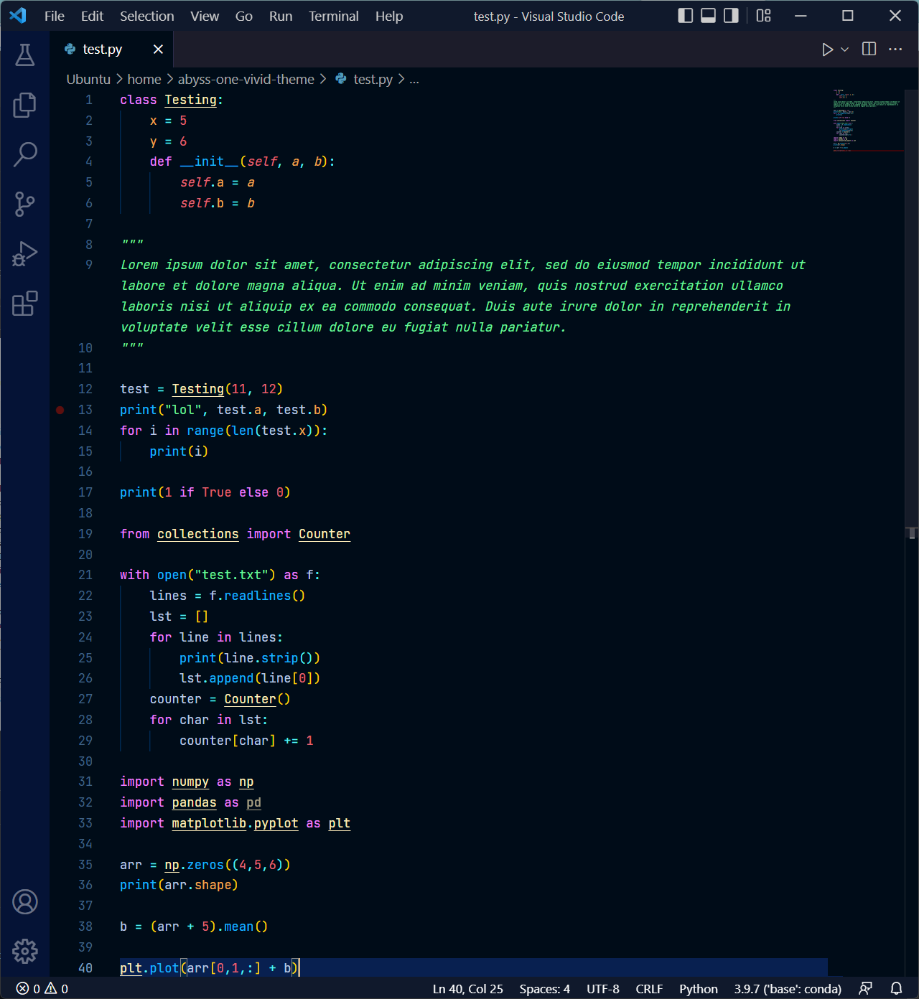

# Abyss One Vivid Theme for VS Code
This is my custom theme for the VS Code editor, which uses the workbench theme from VS Code's built in `Abyss` theme. The code colour scheme was inspired by `One Dark`, and the colours have been personalised for better visibility and aesthetics.

Currently supports:
- [x] Python
- [ ] JavaScript
- [ ] HTML
- [ ] CSS
- [ ] JSON
- [ ] Java

I plan to port this to IntelliJ and other JetBrains IDEs in the future.

Screenshot:

